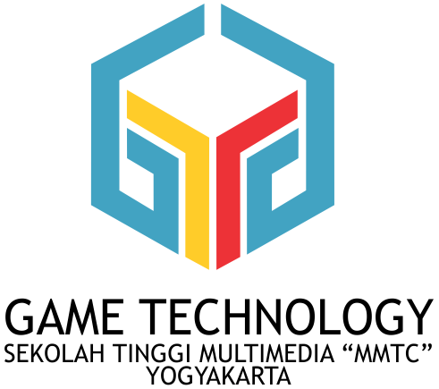
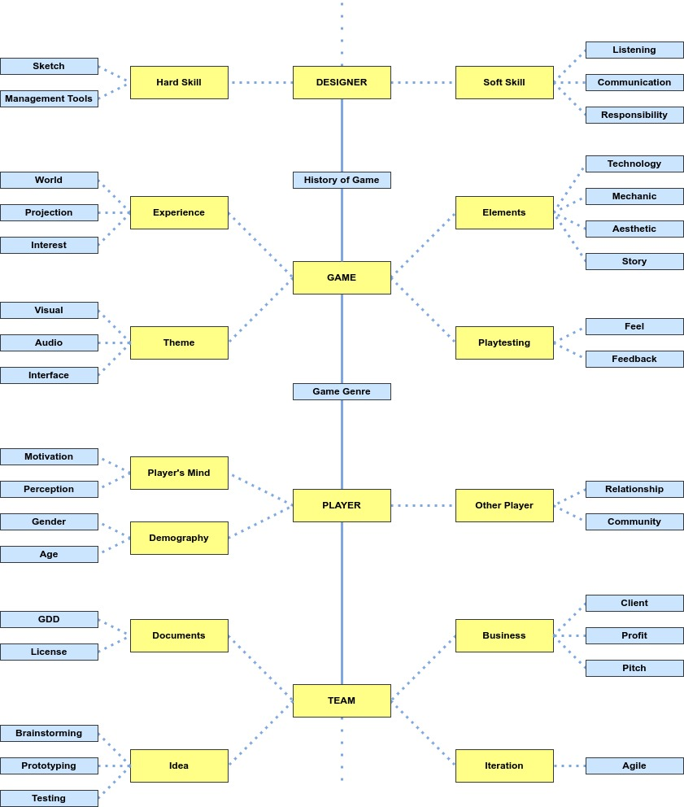
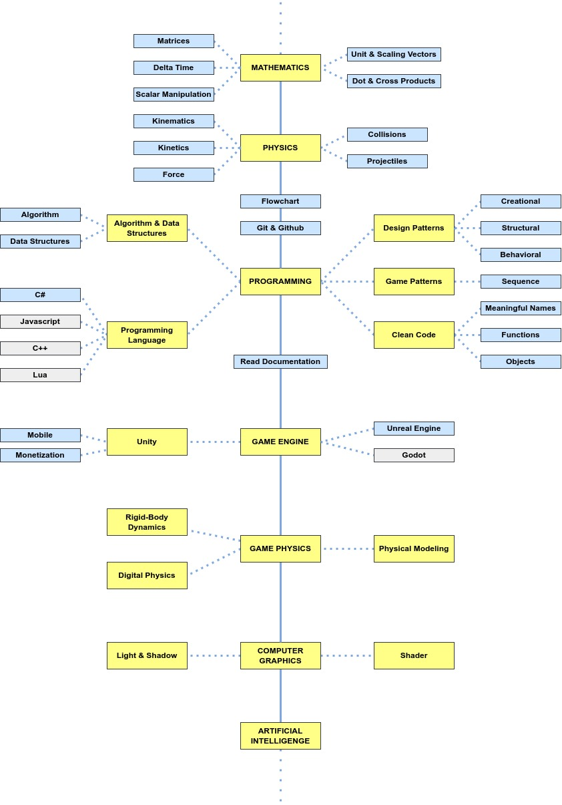
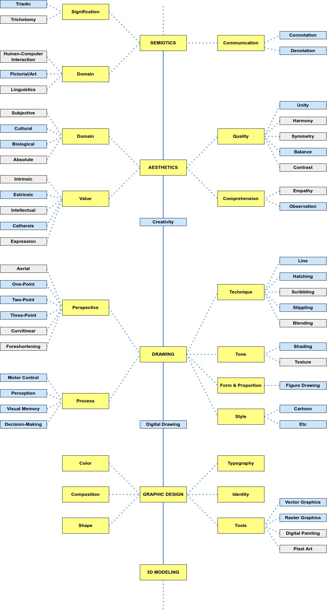

  
  <h2 align="center">Game Developer Roadmap (*dummy)</h2>
  
by HIMA Gametech STMM MMTC Yogyakarta

  

    
    
    
    
  

---

Sebuah roadmap yang ditujukan bagi mahasiswa Prodi Teknologi Permainan sebagai panduan belajar mengenai studi game di STMM. Terdapat 3 (untuk saat ini) alur studi game berdasarkan job desk dalam pengembangan game yaitu [Game Design](#gd), [Game Programming](#gp), dan [Visual Art](#va). Roadmap ini terinspirasi dari [developer-roadmap](https://github.com/kamranahmedse/developer-roadmap) dan [game-developer-roadmap](https://github.com/utilForever/game-developer-roadmap).

---

<a name="gd"/> 

## [Game Design](./game-design.md)

*gambar dibawah belum selesai*

  

    
  

  
...

*Game Design* adalah seni menerapkan desain dan estetika untuk membuat game untuk hiburan atau untuk tujuan pendidikan, latihan, atau eksperimen. Semakin hari, elemen dan prinsip desain game juga diterapkan pada interaksi lain, dalam bentuk gamifikasi. Perancang dan pengembang game Robert Zubek mendefinisikan desain game dengan memecahnya menjadi elemen-elemennya, yang menurutnya adalah sebagai berikut:

- *Gameplay*, yang merupakan interaksi antara pemain dan mekanisme dan sistem
- *Mechanics and systems*, yang merupakan aturan dan objek dalam game
- *Player experience*, yang dirasakan pengguna saat mereka memainkan game

[Selengkapnya ...](./game-design.md)

---

<a name="gp"/> 

## [Game Programming](./game-programming.md)

*gambar dibawah belum selesai*

  

    
  

  
...</a>

*Game Programming*, merupakan salah satu bagian dari bidang pengembangan game yang bekerja dalam pengembangan perangkat lunak dari video game. Pemrograman game membutuhkan keterampilan substansial dalam rekayasa perangkat lunak dan pemrograman komputer dalam bahasa tertentu, serta spesialisasi dalam satu atau lebih bidang berikut: simulasi, grafik komputer, kecerdasan buatan, fisika, pemrograman audio, dan input. Untuk permainan multipemain, pengetahuan tentang pemrograman jaringan diperlukan. [Selengkapnya ...](./game-programming.md)

---

<a name="va"/> 

## [Visual Art](./visual-art.md)

*gambar dibawah belum selesai*

  

    
  

  
...</a>

*Visual Art* atau desain seni video game, adalah bagian dari pengembangan game yang melibatkan proses penciptaan aspek artistik untuk video game. Desain seni video game dimulai pada fase pra-produksi pembuatan video game. Seniman video game adalah seniman visual yang terlibat dari konsep permainan yang membuat sketsa kasar dari karakter, latar, objek, dll. [Selengkapnya ...](./visual-art.md)

---

## Sumber Belajar
Berikut beberapa rekomendasi sumber belajar yang dapat mendukung pembelajaran mandiri Anda.

### Game Design

Judul | Kreator | Media | URL | Deskripsi
--- | --- | --- | --- | ---
Games Crash Course | Crash Course | `Video` | [Link](https://www.youtube.com/playlist?list=PL8dPuuaLjXtPTrc_yg73RghJEOdobAplG) | Sejarah permainan dan melacak bagaimana pengaruhnya dalam olahraga, permainan papan, dan video game saat ini
The Art of Game Design | Jesse Schell | `Buku`, `Artikel` | [Link](https://deck.artofgamedesign.com/) | Buku berisi dasar-dasar merancang game dari bermacam perspektif
Video Game Analysis | The Game Overnalyser | `Video` | [Link](https://www.youtube.com/playlist?list=PL3Oap-xmdQ_AEDwM2nBZ7gkweRN7qsmc1) | Memahami alasan mengapa kita menyukai game yang kita mainkan
Developing | Game Maker's Toolkit | `Video` | [Link](https://www.youtube.com/playlist?list=PLc38fcMFcV_uH3OK4sTa4bf-UXGk2NW2n) | Video blog mengenai proses pembuatan game
Design Talks | GDC | `Video` | [Link](https://www.youtube.com/playlist?list=PL2e4mYbwSTbbjN6TTMo6toJfByWpKvEDH) | Kumpulan presentasi oleh pembicara di GDC
Skill Tree | Asosiasi Game Indonesia | `Video` | [Link](https://www.youtube.com/playlist?list=PLPSNeNN0QgnYEWgprpMpWUAY5lm9bQ6yV) | Perbincangan seputar industri game
Extra Credits: Game Design | Extra Credits | `Video` | [Link](https://www.youtube.com/playlist?list=PLhyKYa0YJ_5BkTruCmaBBZ8z6cP9KzPiX) | Pembicaraan perihal desain game
Game Accessibility Guidelines | Collaborative Effort | `Artikel` | [Link](https://gameaccessibilityguidelines.com/) | Referensi langsung untuk desain game inklusif
Game Studies | gamestudies.org | `Artikel` | [Link](http://gamestudies.org/2202) |  Jurnal internasional penelitian permainan komputer

### Game Programming

Judul | Kreator | Media | URL | Deskripsi
--- | --- | --- | --- | ---
Game Programming Tutorials | freecodecamp.org | `Video` | [Link](https://www.youtube.com/playlist?list=PLWKjhJtqVAbmqFs83T4W-FZQ9kK983tZC) | Kumpulan tutorial pembuatan game dengan teknologi tertentu
Unity Beginner Tutorials | Brackeys | `Video` | [Link](https://www.youtube.com/playlist?list=PLPV2KyIb3jR5QFsefuO2RlAgWEz6EvVi6) | Seri video tutorial Unity bagi pemula
Git & Github | Web Programming UNPAS | `Video` | [Link](https://www.youtube.com/playlist?list=PLFIM0718LjIVknj6sgsSceMqlq242-jNf) | Seri video penggunaan version control system
Math for Game Developer | Jorge Rodriguez | `Video` | [Link](https://youtube.com/playlist?list=PLW3Zl3wyJwWOpdhYedlD-yCB7WQoHf-My) | Seri video matematika dalam pengembangan game
C# Full Course | Bro Code | `Video` | [Link](https://www.youtube.com/watch?v=wxznTygnRfQ) | Kursus lengkap C# bagi pemula (C# untuk Unity)
Design Patterns | Refactoring Guru | `Artikel` | [Link](https://refactoring.guru/design-patterns) | Solusi khas untuk masalah umum dalam desain perangkat lunak
Game Programming Patterns | Bob Nystrom | `Buku`, `Artikel` | [Link](https://gameprogrammingpatterns.com/contents.html) | Kumpulan pola di game untuk membuat kode lebih bersih, lebih mudah dipahami, dan lebih cepat
Clean Code | Robert C. Martin | `Buku` | [Link](https://www.oreilly.com/library/view/clean-code-a/9780136083238/) | Panduan membuat kode bersih untuk efektifitas pengembangan dan organisasi kode
Code Complete | Steve McCinnell | `Buku` | [Link](https://www.oreilly.com/library/view/code-complete-2nd/0735619670/) | Secara luas dianggap sebagai salah satu panduan praktis terbaik untuk pemrograman

### Visual Art

Judul | Kreator | Media | URL | Deskripsi
--- | --- | --- | --- | ---
So You Wanna Make Games? | Riot Games | `Video` | [Link](https://www.youtube.com/playlist?list=PL42m9XiTqPHIJbQZgzDhCyXtMOKNMrRno) | Pengantar bagi pemula untuk menjadi visual artist
Lospec | Lospec | `Artikel` | [Link](https://lospec.com/) | Tools dan resources gratis untuk orang yang membuat pixel art, voxel art, dan lainnya
Graphic Design | gcflearnfree.org | `Video` | [Link](https://www.youtube.com/playlist?list=PLpQQipWcxwt9U7qgyYkvNH3Mp8XHXCMmQ) | Seri video dasar desain grafis
Pixel Art Guideline | studiominiboss.com | `Artikel` | [Link](https://blog.studiominiboss.com/pixelart) | Pedoman dan tutorial membuat pixel art
Blender Fundamentals 2.8 | Blender | `Video` | [Link](https://www.youtube.com/playlist?list=PLa1F2ddGya_-UvuAqHAksYnB0qL9yWDO6) | Seri video official Blender 2.8
Blender Secrets - Modeling | Blender Secrets | `Video` | [Link](https://www.youtube.com/playlist?list=PLrB1kuJIjcg7LoWhvpwllq58DXWOZhP8K) | Seri video teknik 3d modeling menggunakan Blender

---

## Diagram Roadmap

Diagram dibuat menggunakan [drawio](https://app.diagrams.net/). Dapatkan salinan diagram roadmap di:

- [Game Design](https://viewer.diagrams.net/?tags=%7B%7D&highlight=0000ff&edit=_blank&layers=1&nav=1&title=game-design-roadmap#Uhttps%3A%2F%2Fdrive.google.com%2Fuc%3Fid%3D1zMH8_oe8hCYYe2fJHgTRMEDKGmfEJFrZ%26export%3Ddownload)
- [Game Programming](https://viewer.diagrams.net/?tags=%7B%7D&highlight=0000ff&edit=_blank&layers=1&nav=1&title=game-programming-roadmap#Uhttps%3A%2F%2Fdrive.google.com%2Fuc%3Fid%3D1u5DAR5pJPg4FAOOTXMnwAmHpWJCl6UFo%26export%3Ddownload)
- [Visual Art](https://viewer.diagrams.net/?tags=%7B%7D&highlight=0000ff&edit=_blank&layers=1&nav=1&title=visual-art-roadmap#Uhttps%3A%2F%2Fdrive.google.com%2Fuc%3Fid%3D1a8vRh4LrGf4XEHG1XrubhJVlmuXswWGP%26export%3Ddownload)

## Lisensi
Lihat [file lisensi](./LICENSE) untuk lebih detailnya.

## Dukung Kami
...

## Kontak
...